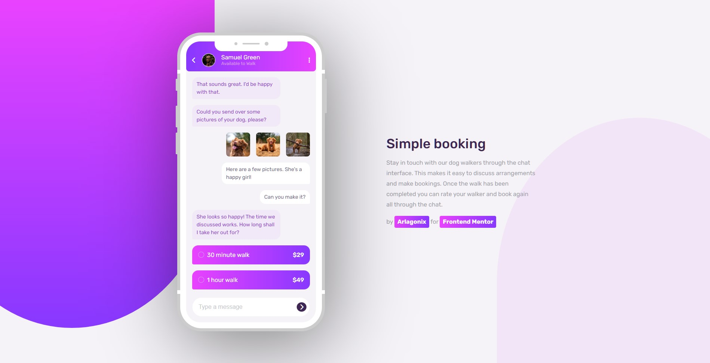
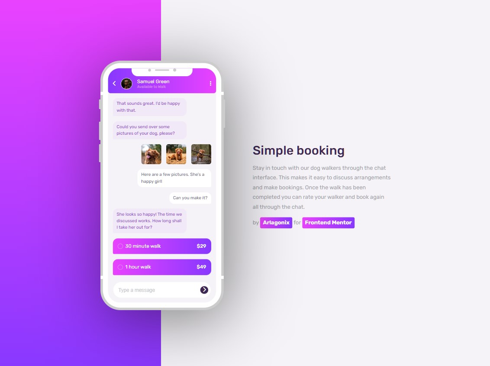

<h1 align="center">Chat App Illustration</h1>
<p align="center">
  Coded with <code>HTML</code>, <code>CSS</code>
</p>

<p align="center">
  
</p>

<p align="center">
  
</p>

## ℹ️ About
This is a solution to the [Chat app CSS illustration challenge on Frontend Mentor](https://www.frontendmentor.io/challenges/chat-app-css-illustration-O5auMkFqY).

* **Build out a feature illustration using HTML & CSS**. 
  * `/design` - Folder with  designs. Contains both a mobile and a desktop version of the design. 
  * `/images` - Folder with assets. The assets are already optimized.
  * `style-guide.md` - File with the style information: color palette, fonts, etc.
* **Get it looking as close to the design as possible**. 
* **The only assets we provide in this challenge are the image of the person in the app UI and the 3 images of the dog**. You need to create everything else using HTML & CSS!
* **Use any tools to like**. You can use any tools you like to help you complete the challenge**. So if you've got something you'd like to practice, feel free to give it a go.
* **Your users should be able to**:
  * View the optimal layout for the component depending on their device's screen size
  * Bonus: See the chat interface animate on the initial load

## ⚙️ Tools

* **HTML5**
  * Semantic HTML
* **CSS**
  * Flexbox
  * Responsive design
  * BEM naming convention
* **Github Pages** - for hosting

## 💡 Features

* **Custom radiobuttons**. It took very much time. I thought it might be easier but still I succeeded. Used an example from W3C, modified it and integrated it in the solution
* **Gradient buttons**
* **Nice Iphone cover**. Initially I replicated the cover from the task. It was easy. Decided to push it further, found some examples in Codepen, chose the best looking, modified it and inserted in the code. The result looks awesome, really glad that invested time into that.
* **Hover and click animation on buttons**
* **Customized input**. Not hard at all. It was a bit tough to insert a submit button inside an input. Made a wrapper, placed the input and the button inside the wrapper and absolutely positioned the button.

## 🔗 Useful resources

- [Codepen : Node : CSS IPhone XS](https://codepen.io/nordchetbi/pen/XyzNyO?editors=1100) - Awesome IPhone design
- [W3Schools: How to create custom checkboxes, radio buttons](https://www.w3schools.com/howto/howto_css_custom_checkbox.asp) - Helped to customize my radio buttons

## 📍 Additional information
 
### Customized input

```html
<label class="enter-message">
  <input
    type="text"
    placeholder="Type a message"
    class="enter-message__input text text--chat-right"
  />
  <button class="enter-message__submit">
    <i class="fa-solid fa-chevron-right text"></i>
  </button>
</label>
```

### Got some practice with the `zoom` CSS attribute

Used it to change the scale of the iphone for different widhts. Initially tried to used `transform: scale();` but it didn't work pretty well because the element continued to obtain the initial big space in the document. `zoom` solved that problem.

## 👤 Author

* Frontend Mentor - [@GrbnvAlex](https://www.frontendmentor.io/profile/GrbnvAlex)
* Telegram - [@Arlagonix](https://t.me/Arlagonix)
* Github - [@arlagonix](https://github.com/arlagonix)
